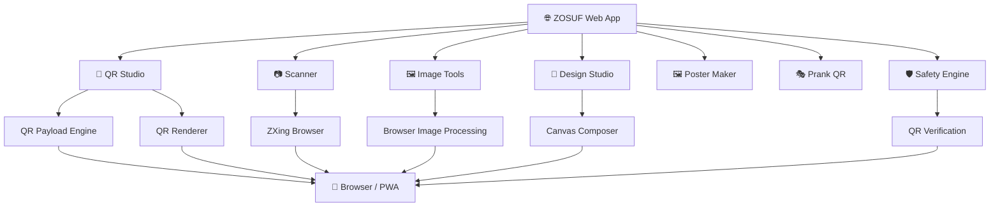

<!-- ================================================================ -->

<!--                         ZOSUF README                             -->

<!--        Privacy-First QR Studio & Browser Tools                  -->

<!-- ================================================================ -->

<div align="center">


<br/>


<br/><br/>

<a href="https://markzosuf.pages.dev">

</a>

<a href="https://github.com/MARKZOSUF/QR-SCANNER-WEBSITE">

</a>


<br/><br/>


</div>

---

# 🌌 What is ZOSUF?

> **ZOSUF is a futuristic browser-first QR & visual utility platform built for speed, creativity and privacy.**

Create QR codes.

Scan QR codes.

Design beautiful QR experiences.

Transform images.

Build posters.

Generate safe prank QR experiences.

All from one modern interface.

<div align="center">

### ⚡ CREATE → DESIGN → SCAN → TRANSFORM → SHARE ⚡

</div>

---

# ✨ The ZOSUF Experience

<table>
<tr>

<td width="25%" align="center">

### ⚡

**FAST**

Browser-first tools with a lightweight architecture.

</td>

<td width="25%" align="center">

### 🎨

**CREATIVE**

Gradients, designs, styling and visual customization.

</td>

<td width="25%" align="center">

### 🔐

**PRIVACY**

Designed around browser-side processing and minimal infrastructure.

</td>

<td width="25%" align="center">

### 📱

**PWA**

Installable, responsive and mobile-friendly experience.

</td>

</tr>
</table>

---

# 🚀 Feature Universe

<div align="center">

|         🚀 TOOL         | 💎 WHAT IT DOES                       |
| :---------------------: | :------------------------------------ |
|     🎯 **QR Studio**    | Generate customized QR codes          |
|    📷 **QR Scanner**    | Scan QR codes directly in the browser |
|    🖼️ **Image → QR**   | Transform images into QR experiences  |
| 🎨 **QR Design Studio** | Advanced visual QR customization      |
|    🧰 **Image Tools**   | Browser-based image utilities         |
|   🖼️ **Poster Maker**  | Create printable visual posters       |
|     🎭 **Prank QR**     | Create safe custom QR experiences     |
|    🛡️ **QR Safety**    | Inspect and verify QR payloads        |

</div>

---

# 🎨 Visual Design System

ZOSUF isn't designed like a traditional utility website.

It's designed like a **digital creative workspace**.

```text
╭──────────────────────────────────────────────────────╮
│                                                      │
│                    Z O S U F                         │
│                                                      │
│       ✦ QR        ✦ DESIGN        ✦ TOOLS            │
│                                                      │
│       ◉ Create     ◉ Customize     ◉ Scan            │
│                                                      │
╰──────────────────────────────────────────────────────╯
```

### 🌈 Visual language

```text
NEON GRADIENTS
      ↓
GLASS EFFECTS
      ↓
SMOOTH MOTION
      ↓
MICRO INTERACTIONS
      ↓
MODERN DARK UI
      ↓
FUTURISTIC WORKSPACE
```

---

# 🧬 Architecture



---

# 🧠 Technology Stack

<div align="center">


<br/><br/>


<br/>


</div>

---

# 🗂️ Project Structure

```text
QR-SCANNER-WEBSITE/
│
├── 📁 public/
│   ├── manifest.webmanifest
│   ├── sw.js
│   ├── robots.txt
│   ├── sitemap.xml
│   └── icons/
│
├── 📁 src/
│   │
│   ├── 📁 features/
│   │   ├── 📁 qr/
│   │   │   ├── QRGenerator.tsx
│   │   │   ├── QRDesignStudio.tsx
│   │   │   ├── QRRenderer.tsx
│   │   │   ├── QRTypeSelector.tsx
│   │   │   ├── StudioLivePreview.tsx
│   │   │   └── canvasComposer.ts
│   │   │
│   │   ├── 📁 scanner/
│   │   ├── 📁 images/
│   │   ├── 📁 poster/
│   │   └── 📁 pranks/
│   │
│   ├── 📁 utils/
│   │   ├── qrPayloads.ts
│   │   ├── qrSafety.ts
│   │   ├── qrVerifier.ts
│   │   └── safePrankEncoder.ts
│   │
│   └── 📁 config/
│
├── 📁 tests/
│
├── package.json
├── vite.config.ts
├── wrangler.toml
└── README.md
```

---

# ⚙️ Run ZOSUF Locally

```bash
git clone https://github.com/MARKZOSUF/QR-SCANNER-WEBSITE.git

cd QR-SCANNER-WEBSITE

npm install

npm run dev
```

Then open the local development URL shown by Vite.

---

# 🧪 Quality & Testing

```bash
npm run typecheck
```

```bash
npm run lint
```

```bash
npm run test
```

```bash
npm run verify
```

### Production build

```bash
npm run build
```

---

# ☁️ Deployment

ZOSUF is structured for static hosting.

```text
                ZOSUF
                  │
        ┌─────────┴─────────┐
        ↓                   ↓
     GitHub              Cloudflare
        │                   │
        └─────────┬─────────┘
                  ↓
             🚀 LIVE WEB
```

Current deployment:

**https://markzosuf.pages.dev**

---

# 📱 Progressive Web App

ZOSUF includes PWA-oriented functionality for a more app-like browser experience.

```text
🌐 Website
   ↓
📲 Install
   ↓
🏠 Home Screen
   ↓
⚡ Fast Launch
   ↓
🎯 QR Workspace
```

---

# 🔐 Privacy & Security Philosophy

ZOSUF follows a **browser-first architecture**.

### Core principles

```text
🔒 Minimal infrastructure
⚡ Browser-first processing
🧩 No required backend
🔑 No required API keys
🛡️ QR safety utilities
📱 PWA-friendly
```

> Always review generated QR content before sharing it, especially when it contains external links or other user-supplied data.

---

# 🎯 Why ZOSUF?

Most QR tools are built around a single input box.

ZOSUF takes a different approach:

```text
                 ┌─────────────┐
                 │    INPUT    │
                 └──────┬──────┘
                        ↓
              ┌───────────────────┐
              │   QR ENGINE       │
              └─────────┬─────────┘
                        ↓
        ┌───────────────┼───────────────┐
        ↓               ↓               ↓
    🎨 DESIGN        📷 SCAN        🖼️ IMAGE
        │               │               │
        └───────────────┼───────────────┘
                        ↓
                 ✨ ZOSUF OUTPUT
```

---

# 🌟 Design Philosophy

### Not just a QR generator.

### A complete QR workspace.

```text
     CREATE
        ↓
     CUSTOMIZE
        ↓
      VERIFY
        ↓
       EXPORT
        ↓
       SHARE
```

---

# 🛣️ Roadmap

```text
[x] QR Generator
[x] QR Scanner
[x] QR Design Studio
[x] Image → QR
[x] Image Tools
[x] Poster Maker
[x] QR Safety
[x] PWA foundation

[ ] Advanced templates
[ ] More export presets
[ ] Advanced poster system
[ ] More visual effects
[ ] Expanded QR utilities
```

---

# 💻 Developer Setup

Requirements:

```text
Node.js >= 20
npm
Modern Browser
Git
```

Install dependencies:

```bash
npm install
```

Development:

```bash
npm run dev
```

Production:

```bash
npm run build
```

---

# 🤝 Contributing

Want to improve ZOSUF?

```text
Fork
  ↓
Create Branch
  ↓
Build
  ↓
Test
  ↓
Commit
  ↓
Pull Request
```

Example:

```bash
git checkout -b feature/my-feature

git add .

git commit -m "Add: my feature"

git push origin feature/my-feature
```

---

# 🧑‍💻 Creator

<div align="center">


### **MARK ZOSUF**

`@markzosuf`

<br/>

<a href="https://github.com/MARKZOSUF">

</a>

<a href="https://instagram.com/markzosuf">

</a>

</div>

---

# ⚡ ZOSUF STATUS

<div align="center">

```text
╔════════════════════════════════════════════╗
║                                            ║
║          Z O S U F   //   2.0              ║
║                                            ║
║       QR • DESIGN • SCAN • CREATE          ║
║                                            ║
║             SYSTEM ONLINE                  ║
║                                            ║
╚════════════════════════════════════════════╝
```

<br/>


### ⭐ If you like the project, consider giving it a star.

**ZOSUF — Create Beyond QR.**

</div>
