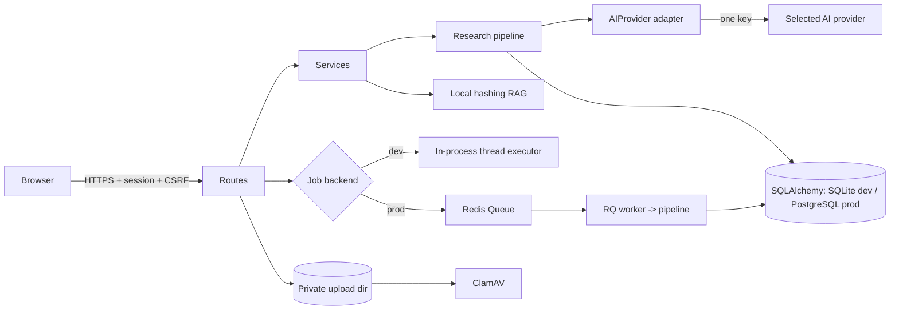

# Architecture

StudyResearch AI is a server-rendered Flask application. The browser talks to
Flask routes; routes call services; a single configured AI provider adapter is
the only external AI dependency. One external key (`AI_API_KEY`) exists; local
hashing embeddings, parsing, malware scanning (ClamAV), and PDF export need no
other keys.

## Components

## Component boundaries

- **Routes** (`routes/`): request validation, ownership checks, readiness
  gates, rate limits, serialization. No AI or parsing internals.
- **Services** (`services/`): provider adapters, research pipeline, citation
  validation, document parsing, RAG, syllabus analysis, PDF export, jobs.
- **Models** (`models/`): persistence only; ownership is transitive through
  `ResearchSession.user_id`.
- **Utils** (`utils/`): auth guards, URL/SSRF validation, structured errors,
  quota accounting, input cleaning, prompt-metadata sanitization.

## Operating modes

| Mode | Requirement | Behavior |
|---|---|---|
| Full Research | `study_mode == "full_research"` and provider declares `web_search` | Provider search → SSRF-safe fetch → extraction → scoring → synthesis |
| Document Study | `study_mode == "document_study"` and ≥1 owned document | No web search, ever — even for search-capable providers |

Mode is decided at request time in `routes/research.py` and enforced again in
`services/research/pipeline.py` (defense in depth). Follow-up sessions inherit
the parent mode.

## Background jobs

Development uses a clearly labeled in-process thread executor. Production
requires Redis/RQ (validated at startup). Job execution is idempotent: only a
session still in `queued` state can be claimed by a worker, so duplicate
executions return immediately. Enqueue failure marks the session failed and
refunds the daily allowance. `flask recover-stuck` fails sessions stuck in
queued/running past `STUCK_SESSION_MINUTES`.

## Persistence

SQLAlchemy models are the schema authority; Alembic revisions are explicit
(`op.create_table`, `op.add_column`) — `create_all`/`drop_all` are never used
in migrations. SQLite is supported for development/tests, PostgreSQL for
production; dialect-specific SQL in revisions is gated on the bind dialect.
