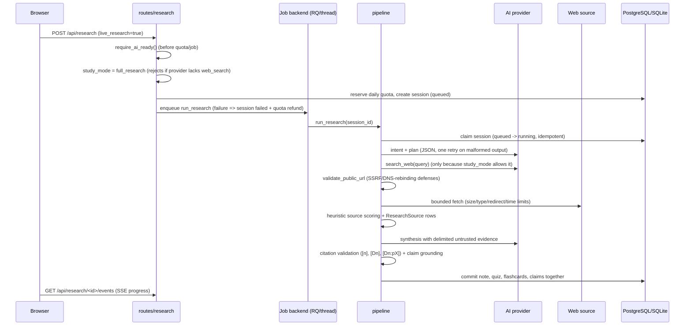

# Data flow

## Full Research flow



## Document Study flow

```mermaid
sequenceDiagram
    participant U as Browser
    participant R as routes
    participant P as pipeline
    participant A as AI provider
    U->>R: POST /api/documents/upload
    R->>R: extension/MIME/signature checks, ClamAV, archive limits
    R->>R: parse in-process (cooperative timeout), dedupe by sha256
    U->>R: POST /api/research (live_research=false, document_ids=[...])
    R->>R: require_ai_ready(); require >=1 owned document
    Note over P: study_mode = document_study: search_web is NEVER called,
    even for search-capable providers. Follow-ups inherit the mode.
    P->>A: intent/plan/synthesis over document evidence (D1..Dn labels)
```

## Chat / RAG flow

1. `POST /api/chat` requires an owned, completed session and AI readiness.
2. RAG evidence: local hashing vectors over source chunks `[n]` and document
   chunks `[Dn]`; top-8 chunks are the primary factual context.
3. Prompt layout is strictly delimited: system rules (system role) →
   `<CONVERSATION_HISTORY untrusted="true">` (bounded, sanitized) →
   `<UNTRUSTED_EVIDENCE>` → `<CURRENT_QUESTION>`. Stored messages can never
   override system/evidence rules.
4. Both turns are stored in `ConversationMessage`; `GET /api/chat` returns
   the bounded history to the owner only.

## Background-job lifecycle

`queued` → (worker claims) → `running` → `complete` | `failed`
- Duplicate worker execution: second claim finds status != queued → no-op.
- Enqueue failure: session marked `failed` (JOB_ENQUEUE_FAILED), quota refunded.
- Stuck queued/running sessions: `flask recover-stuck` marks them failed
  (STALE_JOB_RECOVERED); users can retry with `POST /api/research/<id>/retry`
  (no extra quota; rate-limited).
- RQ jobs run with `RESEARCH_JOB_TIMEOUT`; failures keep RQ failure metadata
  for 7 days (`failure_ttl`).
