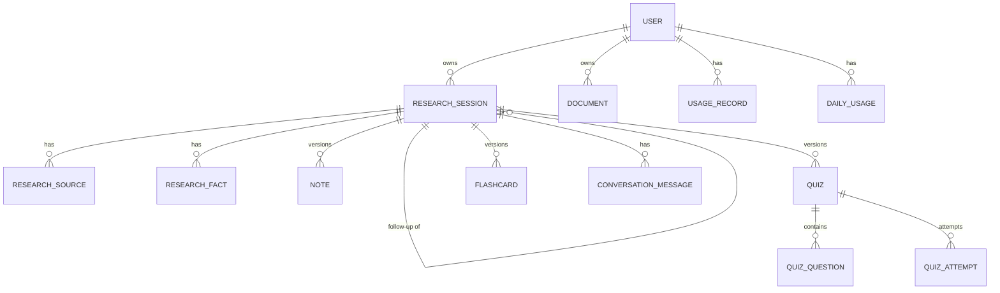

# Data model

## Tables

| Table | Purpose | Key rules |
|---|---|---|
| `user` | Accounts | unique email (casefolded), unique public_id; scrypt password hashes; `session_version` invalidates sessions on password change / logout-all |
| `research_session` | One research run | owner `user_id` (CASCADE); self-FK `parent_session_id` (SET NULL); `study_mode` ∈ full_research/document_study; unique `job_id` |
| `research_source` | Web evidence | unique (session_id, url_hash); `citation_index` = `[n]` label |
| `research_fact` | Atomic claims | status ∈ supported / partially_supported / needs_verification / contradicted; web refs as source public ids; document refs as `D1` / `D1:p3` labels |
| `note` | Study notes | unique (session_id, version); `is_current` marks the active version |
| `quiz` | Quiz versions | unique (session_id, version); latest `score` denormalized |
| `quiz_question` | MCQs | validated: question, exactly 4 distinct options, answer ∈ options, explanation defaulted |
| `quiz_attempt` | Immutable submissions | (quiz_id CASCADE, user_id CASCADE), score, next_difficulty, answers snapshot; never updated or deleted |
| `flashcard` | Cards | unique (session_id, content_hash of normalized casefolded text); regeneration archives (`is_current=false`) instead of deleting, preserving `status` progress |
| `document` | Uploads | unique (user_id, sha256); unique random `stored_name`; `page_map_json` enables `[Dn:pX]` references |
| `conversation_message` | Chat turns | (session_id CASCADE); content treated as untrusted in prompts |
| `usage_record` | Audit log | never stores secrets or prompt bodies |
| `daily_usage` | Quota | unique (user_id, day, action); atomic conditional increment |

## Ownership rules

Every lookup filters by the authenticated owner: documents and sessions by
`user_id`; notes, quizzes, flashcards, messages by joining to the session's
owner. Cross-user access returns 404 (existence is not leaked).

## Cascade behavior

Deleting a user cascades sessions, documents, usage rows. Deleting a session
cascades sources, facts, notes, quizzes (+questions +attempts), flashcards,
and chat messages. Documents are shared per-user across sessions and are only
removed explicitly (with physical file deletion and orphan cleanup).

## Versioning behavior

Notes and quizzes version per session; quiz attempts are immutable; flashcards
archive superseded content. Nothing silently deletes history.
